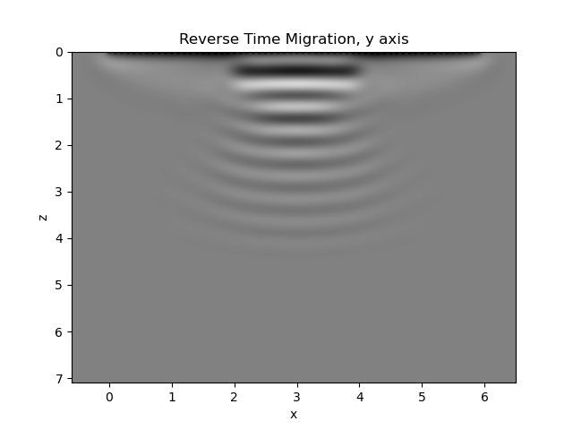

# Reverse-Time-Migration
We have created a program for reverse time migration in seismic exploration using a two-dimensional elastic wave propagation model.　

# Characteristics
## Reverse time migration program for seismic exploration
Reverse Time Migration(RTM) is a seismic wave inversion method that calculates reflection cross sections by combining (closs-correlation, convolution, etc...) seismic wave forward and backward propagation data by the observed waveform and source.
This program implements RTM using seismic wave forward propagation modeling and backward propagation equation of P-SV wave and SH wave.
## Python + GPU (CuPy) 
While based on Python, parallel processing using a GPU is possible by using CuPy.

# Examples 
Sample waveform file in np.array format.\n
example rho model\n

1. This program 弾性波動伝播方程式を用いて弾性波探査におけるリバースタイム・マイグレーション
